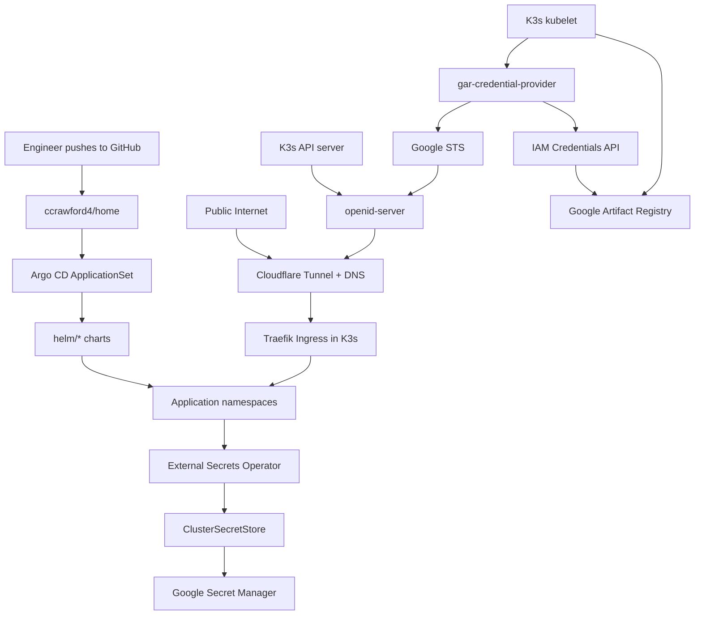
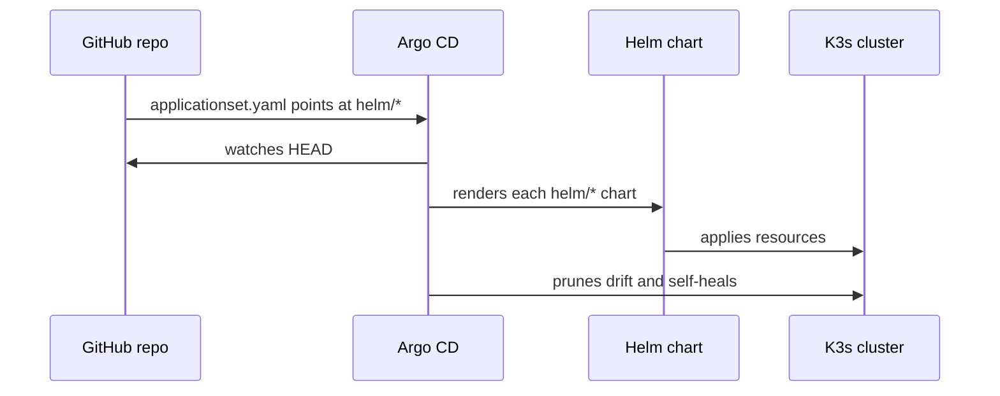
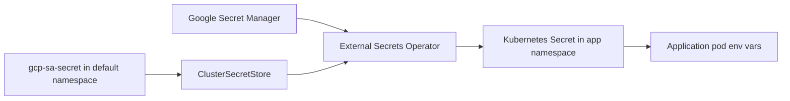
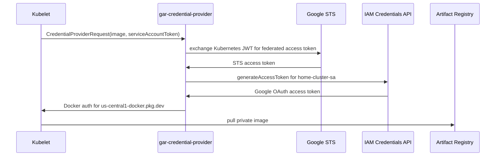

# home

This repository is the control plane for a Raspberry Pi K3s home cluster. It
contains the Terraform, Helm charts, GitOps manifests, and small Go utilities
that make the cluster reproducible.

The interesting part is not just that it runs a few apps. The repo wires
together:

- K3s on Raspberry Pis as the Kubernetes runtime.
- Argo CD ApplicationSets for GitOps deployment.
- Cloudflare Tunnel and DNS for public hostnames.
- External Secrets Operator backed by Google Secret Manager.
- Google Workload Identity Federation (WIF) using Kubernetes service account
  tokens and a public OpenID issuer.
- A custom kubelet credential provider that exchanges projected Kubernetes
  service account tokens for Google Artifact Registry credentials.
- Reusable local Helm charts for applications, MySQL, and Redis.

## Architecture at a Glance



## Repository Map

| Path | Purpose |
| --- | --- |
| `applicationset.yaml` | Argo CD `ApplicationSet` that discovers every chart under `helm/*` and syncs it. |
| `install.sh` | Installs Argo CD into the cluster with the server exposed as an insecure in-cluster service for Traefik/Cloudflare. |
| `terraform/` | GCP, Cloudflare, Secret Manager, Artifact Registry, and WIF infrastructure. |
| `helm/` | Deployable cluster charts: namespaces, networking, identity, apps, and vendored External Secrets Operator. |
| `helm-library/` | Local reusable charts for app deployments, MySQL, and Redis. |
| `infrastructure/k3s/` | K3s config needed for service-account issuer metadata and kubelet image credential providers. |
| `infrastructure/openid-server/` | Go service that exposes Kubernetes OpenID discovery and JWKS through a public hostname. |
| `infrastructure/gar-credential-provider/` | Go kubelet credential-provider plugin for pulling private GAR images with WIF. |

## Deployed Components

The top-level GitOps loop is simple:



Current first-class charts:

| Chart | What it deploys |
| --- | --- |
| `helm/namespaces` | Cluster namespaces used by the apps and infrastructure charts. |
| `helm/external-secrets` | External Secrets Operator chart, including CRDs. |
| `helm/identity-management` | A `ClusterSecretStore` named `cluster-secret-store` for GCP Secret Manager. |
| `helm/networking` | Traefik `Ingress` resources for `search.calum.sh`, `about.calum.sh`, `argocd.calum.sh`, and `openid.calum.sh`. |
| `helm/search-app` | Search frontend, search backend, MySQL, Redis, and synced app secrets. |
| `helm/portfolio` | Portfolio app and an example private GAR-backed nginx deployment. |
| `helm/ai-agent-api` | API with Redis plus Kubernetes read permissions. |
| `helm/openid-server` | Public OpenID proxy used by the WIF flow. |

## Terraform

Terraform owns the cloud-side resources:

- `dns.tf`: Cloudflare Tunnel, tunnel ingress config, and proxied DNS records.
- `gar.tf`: private Google Artifact Registry repository named `internal`.
- `gcs.tf`: GCS bucket for Terraform state storage.
- `wif.tf`: Google Workload Identity Pool, OIDC provider, service account, and GAR reader binding.
- `secrets.tf`: per-application Secret Manager secrets and IAM bindings.
- `modules/secrets_core`: creates Secret Manager secrets and grants access to both a Google service account and a Kubernetes WIF principal.

The required local variables are shown in
`terraform/secrets.auto.tfvars.example`:

```hcl
project_id     = "<your gcloud project id>"
project_number = "<your gcloud project number>"
region         = "us-central1"
k8s_issuer_uri = "https://openid.example.com"

cloudflare_api_token     = "<cloudflare api token>"
cloudflare_account_id    = "<cloudflare account id>"
cloudflare_tunnel_secret = "<cloudflare tunnel secret>"
cloudflare_zone_id       = "<cloudflare zone id>"
k8s_server_ip            = "<private or tunnel-reachable K3s ingress IP>"
```

Run Terraform from the `terraform` directory:

```bash
cd terraform
terraform init
terraform plan
terraform apply
```

Terraform creates Secret Manager secret containers, not secret versions. After
apply, add values explicitly:

```bash
echo -n "actual-secret-value" | gcloud secrets versions add search-app-db-password \
  --project "$PROJECT_ID" \
  --data-file=-
```

Use `echo -n` so the secret does not accidentally include a trailing newline.

## Secrets Model

There are two related identity patterns in this repo.

### 1. Current External Secrets path

The cluster currently syncs Google Secret Manager values through External
Secrets Operator using a Kubernetes secret that contains a Google service
account JSON key.



The `ClusterSecretStore` is defined by
`helm/identity-management/templates/cluster_secret_store.yaml` and configured
in `helm/identity-management/values.yaml`:

```yaml
clusterSecretStores:
  - name: cluster-secret-store
    projectID: "home-473419"
    secretName: gcp-sa-secret
    secretKey: secret-access-credentials
    secretNamespace: default
```

`apply-gcp-secret.sh` bootstraps that key:

```bash
./apply-gcp-secret.sh <project-id> <ssh-host>
ssh <ssh-host> "kubectl apply -f ~/gcp-sa-secret.yaml"
```

That script creates a key for
`secrets-manager-sa@<project-id>.iam.gserviceaccount.com`, renders a
`gcp-sa-secret.yaml`, copies it to the remote host, and removes the temporary
local files.

Application charts then define `ExternalSecret` resources through the local
`application-template` chart:

```yaml
secrets:
  - name: search-app-secrets
    targetName: search-app-secrets
    data:
      - secretKey: db-password
        remoteRefKey: search-app-db-password
```

The app consumes the synced Kubernetes secret like any normal environment
variable:

```yaml
env:
  - name: MYSQL_PASSWORD
    valueFrom:
      secretKeyRef:
        name: search-app-secrets
        key: db-password
```

### 2. Workload Identity Federation path

Terraform also configures Google WIF so Kubernetes service account JWTs can be
trusted by Google without static keys.

The provider in `terraform/wif.tf` maps:

```hcl
attribute_mapping = {
  "google.subject" = "assertion.sub"
  "attribute.ns"   = "assertion['kubernetes.io']['namespace']"
  "attribute.sa"   = "assertion['kubernetes.io']['serviceaccount']['name']"
}
```

The important subject format is:

```text
system:serviceaccount:<namespace>:<service-account>
```

`terraform/modules/secrets_core/iam_policy_binding/main.tf` grants
`roles/secretmanager.secretAccessor` to principals like:

```text
principal://iam.googleapis.com/projects/<project-number>/locations/global/workloadIdentityPools/<pool-id>/subject/system:serviceaccount:search-app:secrets-manager-sa
```

This means the IAM side is prepared for keyless Kubernetes identities. The
current `ClusterSecretStore` chart still uses the JSON key secret above; moving
External Secrets fully onto WIF would require changing the store auth config to
use workload identity instead of `secretRef`.

## Kubernetes OpenID Issuer

Google WIF needs to fetch the issuer discovery document and JWKS for Kubernetes
service account tokens. K3s is configured in `infrastructure/k3s/config.yaml`:

```yaml
kube-apiserver-arg:
  - service-account-issuer=https://openid.calum.sh
  - service-account-jwks-uri=https://openid.calum.sh/openid/v1/jwks
```

The `openid-server` app exposes the Kubernetes API server's built-in discovery
endpoints:

```text
GET /.well-known/openid-configuration
GET /openid/v1/jwks
GET /issuer
GET /healthz
```

It reads the raw Kubernetes API paths:

```bash
kubectl get --raw /.well-known/openid-configuration
kubectl get --raw /openid/v1/jwks
```

Then it rewrites `issuer` and `jwks_uri` to the public issuer URL
(`https://openid.calum.sh`) so Google STS can validate tokens through the
Cloudflare-routed hostname.

The OpenID server service account needs non-resource URL access:

```yaml
rules:
  - nonResourceURLs:
      - "/.well-known/openid-configuration"
      - "/openid/v1/jwks"
    verbs: ["get"]
```

## Private Artifact Registry Pulls

The `gar-credential-provider` is a kubelet exec credential provider. It lets the
node pull private images from Google Artifact Registry using the pod's projected
Kubernetes service account token instead of a Docker config secret.



K3s must enable the kubelet feature gate and point to the provider config:

```yaml
kubelet-arg:
  - "image-credential-provider-config=/etc/rancher/k3s/credential-provider-config.yaml"
  - "image-credential-provider-bin-dir=/var/lib/rancher/gcp-credential-provider/bin"
  - "feature-gates=KubeletServiceAccountTokenForCredentialProviders=true"
```

`infrastructure/k3s/credential-provider-config.yaml` matches the internal GAR
repository and passes the WIF audience:

```yaml
matchImages:
  - "us-central1-docker.pkg.dev/home-473419/internal"
env:
  - name: GAR_IMAGE_PREFIX
    value: us-central1-docker.pkg.dev/home-473419/internal
  - name: STS_AUDIENCE
    value: "//iam.googleapis.com/projects/631401797177/locations/global/workloadIdentityPools/home-cluster-pool/providers/home-cluster-oidc-provider"
  - name: SERVICE_ACCOUNT_EMAIL
    value: home-cluster-sa@home-473419.iam.gserviceaccount.com
tokenAttributes:
  serviceAccountTokenAudience: "//iam.googleapis.com/projects/631401797177/locations/global/workloadIdentityPools/home-cluster-pool/providers/home-cluster-oidc-provider"
  requireServiceAccount: true
```

The plugin validates the image prefix, exchanges the service account JWT with
Google STS, impersonates the configured Google service account, and returns a
`CredentialProviderResponse` containing Docker auth:

```json
{
  "kind": "CredentialProviderResponse",
  "cacheKeyType": "Image",
  "auth": {
    "us-central1-docker.pkg.dev": {
      "username": "oauth2accesstoken",
      "password": "<impersonated-access-token>"
    }
  }
}
```

## Helm Application Pattern

Application charts in `helm/*` are intentionally thin. They compose local
library charts:

```yaml
dependencies:
  - name: application-template
    version: 0.1.0
    repository: "file://../../helm-library/application-template"
  - name: redis
    version: 0.1.0
    repository: "file://../../helm-library/redis"
```

The `application-template` chart can render:

- `ServiceAccount`
- optional `ClusterRole` and `ClusterRoleBinding`
- `ConfigMap`
- `ExternalSecret` or static `Secret`
- `Deployment`
- `Service`
- `HorizontalPodAutoscaler`

A minimal app values file looks like:

```yaml
application-template:
  name: example
  namespace: example
  clusterSecretStoreName: cluster-secret-store
  serviceAccount:
    create: true
    name: example
  deployments:
    - name: example
      replicaCount: 2
      image:
        repository: ghcr.io/example/app
        tag: "v1.0.0"
        port: 8080
      service:
        enabled: true
        port: 80
        targetPort: 8080
```

MySQL and Redis are also local dependency charts. They support persistent
volumes and either External Secrets or static Kubernetes secrets. See
`helm/search-app/values.yaml` for a complete app that composes all three
library charts.

## Getting Started

### 1. Prepare the cluster

Install K3s on the nodes, then apply the relevant settings from
`infrastructure/k3s/config.yaml`. For private GAR image pulls, also copy:

- `infrastructure/k3s/credential-provider-config.yaml` to
  `/etc/rancher/k3s/credential-provider-config.yaml`
- the compiled `gar-credential-provider` binary to the kubelet credential
  provider bin directory, for example
  `/var/lib/rancher/gcp-credential-provider/bin`

Restart K3s after changing kube-apiserver or kubelet args.

### 2. Create cloud infrastructure

Create `terraform/secrets.auto.tfvars` from the example, then run:

```bash
cd terraform
terraform init
terraform plan
terraform apply
```

At minimum, make sure these are correct for your environment:

- `project_id`
- `project_number`
- `k8s_issuer_uri`
- Cloudflare account, zone, tunnel, and API token values
- `k8s_server_ip`

The WIF issuer URL must be publicly reachable by Google STS before keyless token
exchange can work.

### 3. Add Secret Manager versions

Terraform creates secret resources for:

- `search-app`
- `ai-agent-api`
- `portfolio`
- `openid-server`

Add versions for every required secret:

```bash
gcloud secrets versions add openid-server-kubernetes-api-url \
  --project "$PROJECT_ID" \
  --data-file=<(printf %s "https://<kubernetes-api-server>")
```

If your shell does not support process substitution, write the value to a
temporary file and pass that file to `--data-file`.

### 4. Bootstrap External Secrets access

Until the `ClusterSecretStore` is converted to WIF, create the GCP service
account key secret:

```bash
./apply-gcp-secret.sh "$PROJECT_ID" pi@<master-node-ip>
ssh pi@<master-node-ip> "kubectl apply -f ~/gcp-sa-secret.yaml"
```

### 5. Install Argo CD

From the cluster node or any machine with working `kubectl` and `helm` access:

```bash
./install.sh
kubectl apply -f applicationset.yaml
```

Argo CD will discover all directories under `helm/*` and reconcile them into the
cluster.

### 6. Check the rollout

Useful commands:

```bash
kubectl get applications -n argocd
kubectl get pods -A
kubectl get externalsecrets -A
kubectl get ingress -A
kubectl logs -n openid-server deploy/openid-server
```

For WIF/OpenID validation:

```bash
curl https://openid.calum.sh/.well-known/openid-configuration
curl https://openid.calum.sh/openid/v1/jwks
```

For private image pull debugging, inspect kubelet/provider logs and the provider
log configured in `credential-provider-config.yaml`:

```bash
sudo tail -f /var/log/gcp-credential-provider.log
```

## Adding a New Application

1. Create `helm/<app>/Chart.yaml`.

```yaml
apiVersion: v2
name: my-app
type: application
version: 0.1.0
dependencies:
  - name: application-template
    version: 0.1.0
    repository: "file://../../helm-library/application-template"
```

2. Create `helm/<app>/values.yaml`.

```yaml
application-template:
  name: my-app
  namespace: my-app
  clusterSecretStoreName: cluster-secret-store
  serviceAccount:
    create: true
    name: my-app
  deployments:
    - name: my-app
      image:
        repository: ghcr.io/example/my-app
        tag: "v0.1.0"
        port: 8080
      service:
        enabled: true
        port: 80
        targetPort: 8080
```

3. Add the namespace in `helm/namespaces/values.yaml`.

```yaml
namespaces:
  - name: my-app
```

4. Add ingress in `helm/networking/values.yaml` if the app is public.

```yaml
namespaces:
  my-app:
    rules:
      - host: my-app.calum.sh
        paths:
          - path: /
            pathType: Prefix
            serviceName: my-app
            servicePort: 80
```

5. Add Terraform Secret Manager entries if the app needs secrets.

```hcl
module "my-app-secrets" {
  source         = "./modules/secrets_core"
  project_id     = var.project_id
  project_number = var.project_number
  region         = var.region

  label               = "my-app"
  k8s_namespace       = "my-app"
  k8s_service_account = "secrets-manager-sa"
  secrets = [
    "my-app-api-key",
  ]

  google_service_account_id    = "secrets-manager-sa"
  google_service_account_email = "secrets-manager-sa@${var.project_id}.iam.gserviceaccount.com"
  workload_identity_pool_id    = google_iam_workload_identity_pool.home_cluster_pool.workload_identity_pool_id
}
```

6. Reference those secrets from Helm.

```yaml
application-template:
  secrets:
    - name: my-app-secrets
      data:
        - secretKey: api-key
          remoteRefKey: my-app-api-key
  deployments:
    - name: my-app
      container:
        env:
          - name: API_KEY
            valueFrom:
              secretKeyRef:
                name: my-app-secrets
                key: api-key
```

Argo CD will pick up the new chart automatically because the ApplicationSet
generator watches `helm/*`.

## Local Development and Validation

Build or test the Go utilities directly:

```bash
cd infrastructure/openid-server
go test ./...
go build ./...

cd ../gar-credential-provider
go test ./...
go build ./...
```

Render a Helm chart before committing:

```bash
helm dependency update helm/search-app
helm template search-app helm/search-app
```

Run Terraform checks:

```bash
cd terraform
terraform fmt -check
terraform validate
terraform plan
```

## Operational Notes

- Do not commit generated service account keys, `gcp-sa-secret.yaml`,
  `.auto.tfvars`, Terraform state, or kubeconfigs.
- The OpenID issuer hostname must keep serving discovery and JWKS documents. WIF
  token exchange and private image pulls depend on it.
- Secret Manager secrets created by Terraform are empty until a version is
  added.
- The current External Secrets path is key-based. The IAM bindings in Terraform
  also prepare WIF principals, but the Helm `ClusterSecretStore` must be changed
  before ESO itself becomes keyless.
- `applicationset.yaml` syncs every chart under `helm/*`, so partially created
  chart directories can become Argo CD applications.
- The vendored `helm/external-secrets` chart is large because it includes CRDs
  and upstream templates.

## Why This Is Interesting

This repo demonstrates a full small-cluster platform rather than a collection of
one-off manifests. The cluster has a GitOps deployment loop, cloud-managed
secrets, public ingress, app-level chart reuse, cloud IAM federation, and
keyless private image pull mechanics. The custom pieces are intentionally narrow:
the OpenID proxy makes K3s service account identity publicly verifiable, and the
GAR credential provider turns that identity into short-lived registry
credentials at image-pull time.
